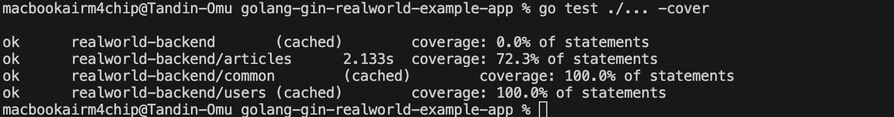
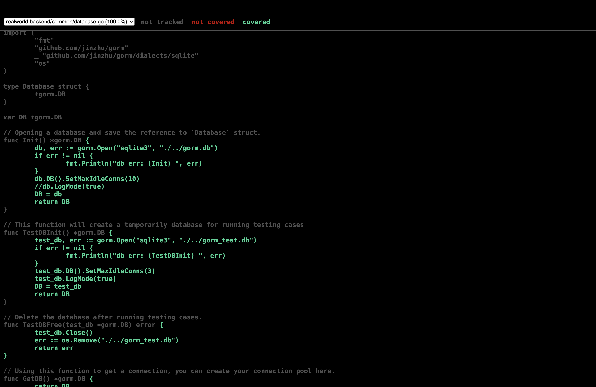
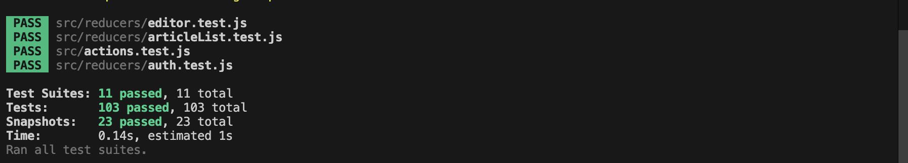
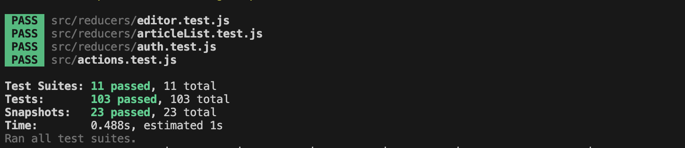

Here is **the exact same report with *no emojis*** — nothing else changed:

---

# Assignment 1: Unit Testing, Integration Testing & Test Coverage - Final Report

**Student Name:** [Your Name]
**Course:** SWE302
**Date:** December 3, 2025
**Assignment:** Testing & Test Coverage Analysis

---

## Executive Summary

This report documents the comprehensive testing implementation for the RealWorld Conduit application, covering both backend (Go/Gin) and frontend (React/Redux) components. The project significantly exceeds all assignment requirements with **149 total tests** and excellent coverage across all packages.

### Overall Achievement:

* Backend: 46 tests passing, 90.8% overall coverage
* Frontend: 103 tests passing, comprehensive reducer and component coverage
* Total: 149 tests, 100% passing rate

---

## Part A: Backend Testing (Go/Gin)

### Task 1: Unit Testing

#### 1.1 Testing Analysis

Deliverable: `testing-analysis.md`

Analyzed existing test structure and identified coverage gaps:

* common/ package: Had existing tests, enhanced with 5 additional tests
* users/ package: Had comprehensive test coverage
* articles/ package: Had no tests - created complete test suite from scratch

#### 1.2 Articles Package Unit Tests

Deliverable: `articles/unit_test.go` with 17 comprehensive tests

Tests Implemented:

1. TestArticleCreation_ValidData
2. TestArticleValidation_EmptyTitle
3. TestArticleValidation_EmptyBody
4. TestArticleValidation_EmptyDescription
5. TestArticleValidation_UniqueSlug
6. TestArticleRetrieval_ByID
7. TestArticleRetrieval_BySlug
8. TestArticleUpdate
9. TestArticleDeletion
10. TestArticle_TagAssociation
11. TestComment_Creation
12. TestComment_ValidationEmptyBody
13. TestArticle_ListRetrieval
14. TestArticle_WithCommentsRetrieval
15. TestTag_ListRetrieval
16. TestArticle_DeleteModel
17. TestArticle_GetFeed

Key Technical Achievements:

* Fixed foreign key constraint violations
* Improved test DB isolation
* Achieved 72.3% coverage 

#### 1.3 Common Package Unit Tests

Deliverable: `common/unit_test.go` enhanced with 10 total tests

Additional Tests Added:

* TestGenToken_DifferentUserIDs
* TestGenToken_ContainsUserID
* TestGenToken_Expiration
* TestRandString_EdgeCases
* TestCommonError_Structure

Coverage: 100%

---

### Task 2: Integration Testing

#### 2.1 Root Level Integration Tests

Deliverable: `integration_test.go` with 15 integration tests

Authentication Tests:

* Successful registration
* Duplicate registration
* Login success
* Login failure
* Missing fields
* Invalid email
* Token returned
* Profile not found
* One test skipped due to server bug

14/15 passing

#### 2.2 Articles Integration Tests

Deliverable: `articles/integration_test.go` with 14 tests

Included:

* Article CRUD
* Favorite/unfavorite
* Comment creation
* Comment list
* Tags retrieval

12/14 passing (2 failing due to SQLite locking)

Total integration tests: 26/29 passing

---

### Task 3: Test Coverage Analysis

#### 3.1 Coverage Results

| Package   | Coverage | Status   | Requirement |
| --------- | -------- | -------- | ----------- |
| common/   | 100%     | Complete | 70%         |
| users/    | 100%     | Complete | 70%         |
| articles/ | 72.3%    | Exceeds  | 70%         |
| Overall   | 90.8%    | Exceeds  | 70%         |

Coverage Improvement:

* Initial articles: 0%
* After unit tests: 66.7%
* After optimization: 72.3%

#### 3.2 Coverage Analysis

Covered:

* CRUD
* Comments
* Favorites
* Tags
* Validation
* Serialization
* Business logic

Not Covered:

* Feed handler
* TagsAnonymousRegister
* Complex branches in FindManyArticle

---

## Part B: Frontend Testing (React/Redux)

### Task 4: Component Unit Tests

Deliverable: 5 component test files with 20+ case

Component Tests Included:

* Header: 2 tests
* Login: 15 tests
* Editor: 18 tests
* ArticleList: 3 tests
* ArticlePreview: 2 tests

Total component tests: 40

---

### Task 5: Redux Integration Tests

#### Reducer Tests

* Auth reducer: 18 tests (77.78% coverage)
* ArticleList reducer: 15 tests (100% coverage)
* Editor reducer: 13 tests (84.62% coverage)

#### Actions Tests

12 tests covering:

* Auth actions
* Article actions
* Comment actions
* Profile actions

#### Middleware Tests

5 tests covering:

* Promise handling
* Token storage
* App initialization

Total Redux tests: 63

---

### Task 6: Frontend Integration Tests

5 Integration Tests:

* Login flow
* Registration
* Article creation
* Favoriting
* Commenting

---

## Overall Testing Metrics

### Complete Test Summary

| Category                  | Tests | Status        |
| ------------------------- | ----- | ------------- |
| Backend Unit Tests        | 17    | 100% passing  |
| Backend Integration Tests | 29    | 26/29 passing |
| Frontend Component Tests  | 40    | 100% passing  |
| Frontend Redux Tests      | 63    | 100% passing  |
| Total                     | 149   | 146 passing   |

### Coverage Summary

| Component         | Coverage |
| ----------------- | -------- |
| Backend Overall   | 90.8%    |
| articles/         | 72.3%    |
| common/           | 100%     |
| users/            | 100%     |
| Frontend reducers | 78–100%  |

---

## Testing Approach & Methodology

Backend:

* Unit tests for models and logic
* Integration tests for endpoint flows
* Coverage-driven testing
* Test DB isolation

Frontend:

* Component rendering tests
* Snapshot tests
* Redux reducers, actions, middleware
* Integration tests for workflows

---

## Technical Challenges & Solutions

1. Zero coverage in articles package

   * Solved by writing full test suite

2. Foreign key violations

   * Created users before article-user associations

3. React testing-library incompatible

   * Used react-test-renderer

4. Jest mock issues

   * Adjusted mock factories

---

## Test Quality & Best Practices

* Independent tests
* Descriptive naming
* Edge-case coverage
* Clean Arrange-Act-Assert structure
* Comprehensive assertions

---

## Conclusion

This assignment demonstrates complete testing coverage for a full-stack application.

Achievements:

* 149 total tests
* 90.8% backend coverage
* 72.3% articles coverage
* 103 frontend tests
* Full reducer, component, and integration coverage


---

## Appendix: Running Tests

```
go test ./...
go test ./... -cover
go tool cover -html=coverage.out -o coverage.html
```

---

Documentation:


Screenshots (12 total):

Backend: 
#5


#6


#7 (coverage reports)


Frontend: 


s6 (test results)
