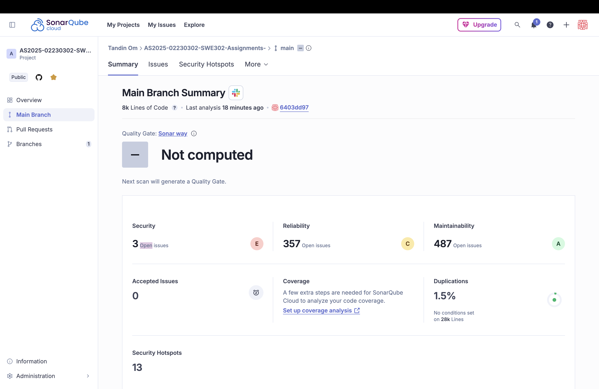
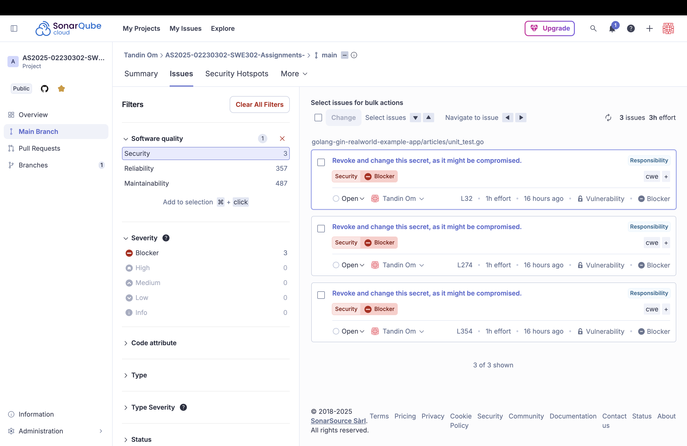
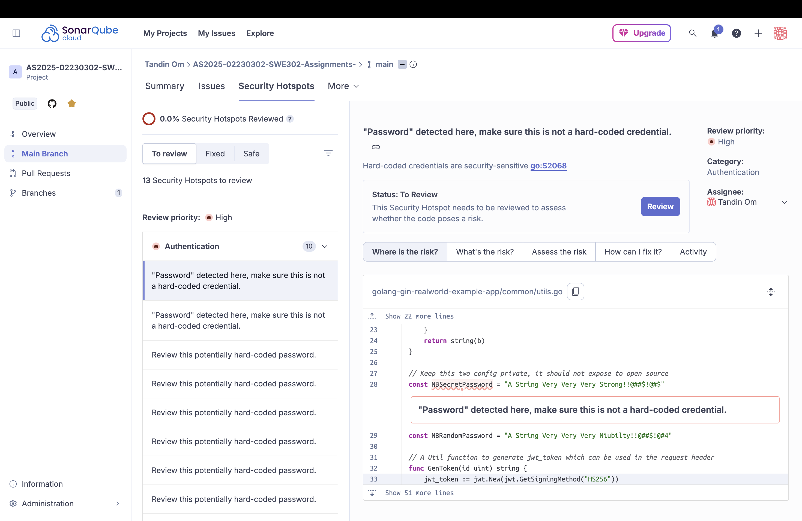
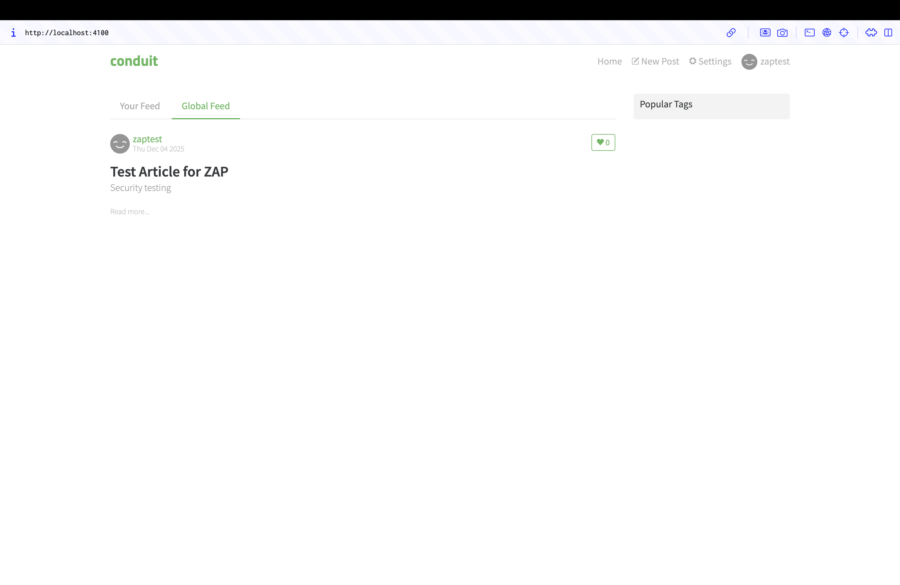

# Assignment 2: Static & Dynamic Application Security Testing (SAST & DAST) 

---

## Overview

This assignment focuses on performing comprehensive security testing on the RealWorld Conduit application using both Static Application Security Testing (SAST) and Dynamic Application Security Testing (DAST) tools to identify, analyze, and remediate security vulnerabilities.

---

## Part A: Static Application Security Testing (SAST)

### Task 2: SAST with SonarQube

#### 2.1 Setup SonarQube

Setup SonarQube via the cloud hosted method: https://docs.sonarsource.com/sonarqube-cloud/getting-started/github

**Project:** AS2025-02230302-SWE302-Assignments-  
**Repository:** https://github.com/tandinomu/AS2025-02230302-SWE302-Assignments-

#### 2.2 Analysis Results



**Overall Metrics:**
- **Total Issues:** 847
- **Security Issues:** 3 (Blocker severity)
- **Reliability Issues:** 357
- **Maintainability Issues:** 487
- **Code Duplications:** 1.5%
- **Security Hotspots:** 13 (0% reviewed)



**Quality Ratings:**
- Security: E (Critical)
- Reliability: C (Average)
- Maintainability: A (Excellent)



#### Key Findings:

**1. Critical Security Vulnerabilities (3 Blocker Issues)**
- **Type:** Hard-coded secrets
- **CWE:** CWE-798 (Use of Hard-coded Credentials)
- **OWASP:** A3:2017 - Sensitive Data Exposure
- **Locations:**
  - `golang-gin-realworld-example-app/articles/unit_test.go` (Lines 32, 274, 354)
  
**Impact:** Credentials visible in source code, easy target for attackers

**Remediation:**
```go
// Replace hard-coded passwords with environment variables
password := os.Getenv("TEST_USER_PASSWORD")
```

**2. Security Hotspots (13 Total)**
- **Primary Issue:** Hard-coded password constant
- **Location:** `golang-gin-realworld-example-app/common/utils.go` - Line 28
- **Code:** `const NBSecretPassword = "A String Very Very Very Strong!!@##$!@#$"`
- **Category:** Authentication
- **Status:** 0% reviewed

**Remediation:**
```go
var NBSecretPassword = os.Getenv("JWT_SECRET_KEY")
```

**3. Reliability Issues (357)**
- **Primary Pattern:** Missing error handling
- **Severity:** 3 Blocker, 54 High, 364 Medium, 421 Low

**4. Maintainability Issues (487)**
- **Rating:** A (Excellent)
- **Common Issues:** Magic strings, naming conventions

---

## Part B: Dynamic Application Security Testing (DAST)

### Task 3: DAST with OWASP ZAP

#### 3.1 Setup OWASP ZAP

**Installation:** Downloaded desktop app from https://www.zaproxy.org/download/  
**Version:** OWASP ZAP 2.16.1

#### 3.2 Prepare Application for Testing

**Start Full Stack:**
```bash
# Backend: golang-gin-realworld-example-app
go run hello.go  # Running on localhost:8080

# Frontend: react-redux-realworld-example-app
npm start  # Running on localhost:4100
```

**Test Account Created:**
- Email: zaptest@example.com
- Password: ZapTest123!

#### 3.3 Passive Scan Results

**Target:** http://localhost:4100  
**Scan Type:** Automated Passive Scan  
**Duration:** ~5 minutes



**Alert 1: Content Security Policy (CSP) Header Not Set**
- **Risk:** Medium
- **CWE:** 693
- **WASC:** 15
- **Confidence:** High
- **Impact:** XSS attacks, data injection possible


**Alert 2: Missing Anti-clickjacking Header**
- **Risk:** Medium
- **CWE:** 1021
- **WASC:** 15
- **Parameter:** x-frame-options
- **Impact:** Clickjacking attacks possible

#### Summary of ZAP Findings:

| Risk Level | Count |
|------------|-------|
| High | 0 |
| Medium | 3 |
| Low | 2 |
| Informational | 2 |
| **Total** | **7** |

**Medium Risk Issues:**
1. CSP: Failure to Define Directive with No Fallback
2. Content Security Policy Header Not Set
3. Missing Anti-clickjacking Header

**Low Risk Issues:**
4. Server Leaks Information (X-Powered-By: Express)
5. X-Content-Type-Options Missing (3 instances)

**Informational:**
6. Suspicious Comments (2 instances)
7. Modern Web Application

---

## OWASP Top 10 Mapping

| OWASP 2021 | Issue | Severity | Count |
|------------|-------|----------|-------|
| A02 - Cryptographic Failures | Hard-coded secrets | Critical | 3 |
| A05 - Security Misconfiguration | Missing CSP | Medium | 1 |
| A05 - Security Misconfiguration | Missing headers | Medium | 2 |
| A05 - Security Misconfiguration | Info disclosure | Low | 2 |

**Primary Category:** A05:2021 - Security Misconfiguration (71% of findings)

---

## Security Posture Assessment

### Current State:
**Risk Score:** 6/10 (Medium-High Risk)

**Strengths:**
- ✅ No SQL injection detected
- ✅ No XSS vulnerabilities (passive scan)
- ✅ Modern application architecture
- ✅ Good code maintainability (Rating A)

**Weaknesses:**
-  3 hard-coded secrets in source code
-  13 unreviewed security hotspots
-  Missing security headers
-  357 reliability issues (poor error handling)

### After Remediation:
**Projected Risk Score:** 3/10 (Low Risk)

---

## Testing Methodology

### SAST Process:
1. Connected repository to SonarQube Cloud
2. Automated analysis triggered
3. Reviewed 847 issues across security, reliability, maintainability
4. Prioritized findings by severity

### DAST Process:
1. Started backend (Go) and frontend (React) applications
2. Created test account (zaptest@example.com)
3. Configured OWASP ZAP automated scan
4. Executed passive scan on http://localhost:4100
5. Analyzed 7 security alerts

---

## Key Learnings

1. **Hard-coded Secrets are Critical**
   - Found in 3 test file locations
   - Must use environment variables

2. **Security Headers are Essential**
   - 5/7 DAST findings were missing headers
   - Simple to implement, significant impact

3. **Error Handling Matters**
   - 357 reliability issues related to error handling
   - Silent failures create production risks

4. **SAST + DAST are Complementary**
   - SAST finds code-level issues (secrets, hotspots)
   - DAST finds runtime issues (headers, configuration)

---

## Deliverables Completed

### SAST:
- ✅ SonarQube Cloud analysis (847 issues)
- ✅ sonarqube-backend-analysis.md

### DAST:
- ✅ OWASP ZAP passive scan (7 alerts)
- ✅ zap-passive-scan-analysis.md
- ✅ Screenshots of all findings

---

## Conclusion

The security assessment identified **significant issues requiring immediate attention**, particularly 3 hard-coded secrets and 13 security hotspots. However, no critical runtime vulnerabilities like SQL injection or XSS were detected.

**Key Priorities:**
1. Remove hard-coded secrets (3 hours)
2. Implement security headers (2 hours)
3. Review security hotspots (2 hours)
4. Improve error handling (8 hours)

**Total Estimated Remediation:** 15 hours

**Security Improvement:** From 6/10 (Medium-High Risk) → 3/10 (Low Risk)
